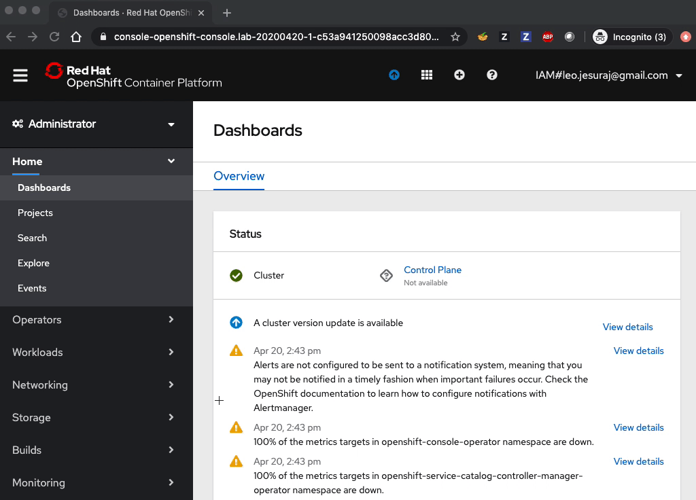

# Workshop Setup

This section contains instructions to access the Red Hat OpenShift cluster on IBM Cloud required for the workshop. The cluster is already configured with the tools you need to be able to complete the labs.

## Browser Requirement

- Make sure you are using a supported browser: Chrome or Firefox is recommended. Do not use Internet Explorer or Edge (various issues were observed with them).

## IBM Cloud account

If you already have an IBM Cloud account, go to the [login page](https://cloud.ibm.com/login) and enter your IBMid and password.

Otherwise, sign up for an IBM Cloud account by using your existing IBMid or by creating a new IBMid:
- Go to the [IBM Cloud login page](https://cloud.ibm.com), and click **Create an account**.
- Enter your IBMid email address. If you don't have an existing IBMid, an ID will be created based on the email that you enter.
- Enter a password, and click **Next**.
- Verify the email. If you don't receive an email within few minutes then check spam folder.
- Complete account creation by providing requested information.
- **Note**: If your IBMid is not with email pattern (e.g., a shortname), please inform the workshop host and a cluster will be assigned manually. Skip the 'Request cluster` section and continue from [Access cluster](#access-cluster) section.

Note: You may optionally deactivate your account after the lab. 
However, we encourage you to keep your account for future labs. 
After deactivation, you will need to contact IBM Support to reactivate it. 
If you insist on deactivation, follow the instructions on the support page for "lite account": https://www.ibm.com/support/pages/how-can-you-cancel-your-ibm-cloud-account.


## Request cluster

You will be given a URL specific to your workshop (e.g. `https://<workshop name>.mybluemix.net`) along with a lab key by email before the workshop. It'll likely be also posted in the chat window. Contact the host if you are not able to find this information.
 
- Point your browser to the workshop URL
- Enter the lab key for your workshop and your IBM ID (with email pattern) to get assigned to a cluster.

  

- After submitting successfully, the _Congratuations_ page similar to the following should be displayed:

  

- Click on _IBM Cloud account_ link. Note your assigned cluster name and ignore the bullet 5 which is not used in this workshop.

## Access cluster 

- If you haven't already, login to your IBM Cloud account: go to the [login page](https://cloud.ibm.com/login) and enter your IBMid and password.
- Once logged in, ensure that the selected account is **2044184 - CP4AWorkshops**. If you don't see that account, try refreshing the webpage. If the account is still not shown then try logging out and logging back in. Contact workshop host if you still don't see that account.

  

- Navigate to IBM Cloud > Resource List

  

- Expand `Clusters` and click on your cluster

  

- Click `Openshift web console` to get access to the console of your cluster.
- Ignore the `IBM Cloud Shell` button for now. It gives you a command line terminal to interact with IBM cloud, and may be used for a future lab.
 
  

## Access the web terminal

The web terminal runs in your Openshift cluster. It gives you command line access to many tools you will use in the workshop. 

The following steps to access the web terminal are illustrated in the screen recording below:

1. From the OpenShift web console, navigate to **Networking** > **Routes**.  Select Project `lab` from the drop-down list and click on the URL of route `tools` (listed under `Location` column). 

1. Click on `Log in with OpenShift`

1. Click on `Allow selected permissions`

    - Note: The authorization permission page above may not display again in the subsequent access as the information will already be in the browser cookie cache.

1. The web terminal will be displayed. 

1. Enter `ls` to verify that the web terminal lists the files and folders in the directory.

    


## Login to OpenShift CLI

The following steps to login to OpenShift CLI (command-line interface) using web terminal are illustrated in the screen recording below:

1. From the Openshift console, click on the twisty next to your login name and select `Copy Login Command`.

1. In the new window that pops up, click on `Display Token`:

1. To login to your OpenShift cluster, copy the command under `Log in with this token`, then paste it into the web terminal. The command looks like:

    ```
    oc login --token=<TOKEN> --server=<SERVER Address>
    ```

1. After login, the project last accessed is displayed, and it may or may not be the `default` project shown below:

    ```
    Logged into "<SERVER address" as "<USER>" using the token provided.

    You have access to 56 projects, the list has been suppressed. You can list all projects with 'oc projects'
    
    Using project "default".
    ```

1. Leave the web terminal open as it's needed for the labs.

    


Congratulations! You've completed the lab setup.

## Next

Check out the [pre-requisites](../README.md#pre-requisites) information.