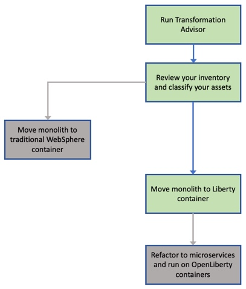
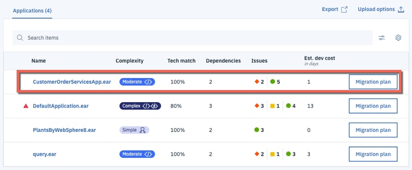
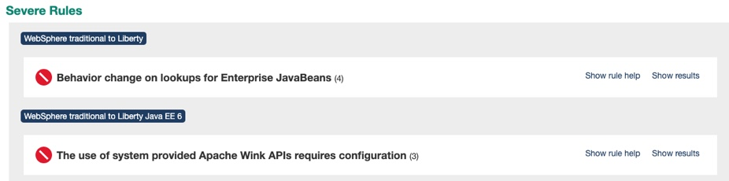
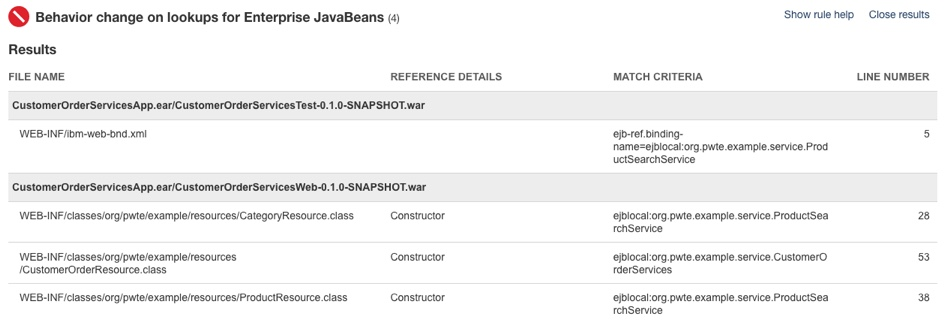

# Application Modernization: WebSphere Runtime Modernization Solution

## Introduction

**Runtime modernization** moves an application to a 'built for the cloud' runtime with the least amount of effort. **Open Liberty** is a fast, dynamic, and easy-to-use Java application server. Ideal for the cloud, Liberty is open sourced, with fast startup times (<2 seconds), no server restarts to pick up changes, and a simple XML configuration.

However, Liberty doesn't support all of the legacy Java EE and WebSphere proprietary functionality and some code changes maybe required to move an existing application to the new runtime. Effort is also required to move the application configuration from traditional WebSphere to Liberty's XML configuration files.

**This path gets the application on to a cloud-ready runtime container which is easy to use and portable. In addition to the necessary library changes, some aspects of the application was modernized. However, it has not been 'modernized' to a newer architecture such as micro-services** 

  The diagram below shows the high level decision flow where IBM Cloud Transformation Advisor is used to analyze existing assets and a decision is made to move the monolithic application to the Liberty container.

  

This repository holds a solution that is the result of a **runtime modernization** for an existing WebSphere Java EE application that was moved from WebSphere ND v8.5.5 to Liberty and deployed by the IBM CloudPak for Applications to RedHat OpenShift.

We'll use the same [Customer Order Services application](../common/application.md) from the **Operational Modernization** lab as an example. In order to modernize the runtime, the application will go through through **analysis**, **build** and **deploy** phases.

## Table of Contents

- [Analysis](#analysis)
- [Build](#build)
- [Deploy](#deploy)
- [Access the Application](#access-the-application)
- [Summary](#summary)

## Analysis

As before, [IBM Cloud Transformation Advisor](https://www.ibm.com/cloud/garage/practices/learn/ibm-transformation-advisor) was used to analyze the existing Customer Order Services application and the WebSphere ND runtime. The steps were:

1. Installed Transformation Advisor Local.

2. Downloaded and executed the **Data Collector** against the existing WebSphere ND runtime.

3. Uploaded the results of the data collection to IBM Cloud Transformation Advisor. A screenshot of the analysis is shown below:

    

- In the case of the **CustomerOrderServicesApp.ear** application, IBM Cloud Transformation Advisor has determined that the migration to Liberty on Private Cloud is of **Moderate** complexity and that there are two **Severe Issues** that have been detected.

- Drilling down in to **Detailed Migration Analysis Report** that is part of the application analysis, it is apparent that IBM Cloud Transformation Advisor has detected that there are issues with lookups for Enterprise JavaBeans and with accessing the Apache Wink APIs.

  

- **Behavior change on lookups for Enterprise JavaBeans** In Liberty, EJB components are not bound to a server root Java Naming and Directory Interface (JNDI) namespace as they are in WebSphere Application Server traditional. The fix for this is to change the three classes that use `ejblocal` to use the correct URL for Liberty

- **The user of system provided Apache Wink APIs requires configuration** To use system-provided third-party APIs in Liberty applications, you must configure the applications to include the APIs. In WebSphere Application Server traditional, these APIs are available without configuration. This is a configuration only change and can be achieved by using a `classloader` definition in the Liberty server.xml file.

- In summary, some minimal code changes are required to move this application to the Liberty runtime and the decision was taken to proceed with these code changes.

**Homework**: After you complete this workshop, review the step-by-step instructions on how to replicate these steps from the [Next Steps](../resources.md) section. Then try Transformation Advisor with one of your applications to migrate it to Liberty.


## Build

In this section, you'll learn how to build a Docker image for Customer Order Services application running on Liberty.

Building this image could take around ~5 minutes (multi-stage build that compiles the code, which takes extra time). As before, let's kick that process off and then come back to learn what you did.

You'll need the web terminal. If it's not open, follow the instructions [here](../common/web-terminal.md) to access it.

Clone the GitHub repo with the lab artifacts for Liberty (this are different from the artifacts cloned earlier). Run the following commands on your web terminal:
```
cd / && mkdir liberty && cd liberty
git clone --branch liberty https://github.com/IBM/teaching-your-monolith-to-dance.git
cd teaching-your-monolith-to-dance
```

Run the following command in web terminal to start building the image. While the image is building continue with rest of this section:

```
docker build --tag image-registry.openshift-image-registry.svc:5000/apps/cos .
```

The **build** phase made changes to source code and created the Liberty configuration artifacts. The steps were:

- Made the simple code changes required for the EJB lookups which were recommended by IBM Cloud Transformation Advisor. The three Java classes that should be modified to look up Enterprise JavaBeans differently are shown in the detailed analysis view of IBM Cloud Transformation Advisor:

  

- Below is an example of the code changes required for one of the three Java classes. The `org.pwte.example.resources.CategoryResource.java` is changed from using `ejblocal` as shown below:

  Before:

    ```java
    ...
    InitialContext().lookup("ejblocal:org.pwte.example.service.ProductSearchService");
    ...
    ```

  After:

  ```java
  ...
  InitialContext().lookup("java:app/CustomerOrderServices/ProductSearchServiceImpl!org.pwte.example.service.ProductSearchService");
  ...
  ```

- The Liberty runtime configuration file `server.xml`was created from the template provided by IBM Cloud Transformation Advisor. The final versions of the file can be found here:

    - [server.xml](https://github.com/IBM/teaching-your-monolith-to-dance/tree/liberty/config/server.xml)

- The [`Dockerfile`](https://github.com/IBM/teaching-your-monolith-to-dance/tree/liberty/Dockerfile) required to build the immutable image containing the application and Liberty runtime was created from the template provided by IBM Cloud Transformation Advisor. Here is the final version of the file:

  ```dockerfile
  ## Build stage
  FROM maven:latest AS builder
  COPY app/ /
  RUN cd CustomerOrderServicesProject && mvn clean package

  ## Application image
  FROM openliberty/open-liberty:full-java8-openj9-ubi

  COPY --chown=1001:0 resources/ /opt/ol/wlp/usr/shared/resources/

  COPY --chown=1001:0 config/server.xml /config/
  
  COPY --from=builder --chown=1001:0 CustomerOrderServicesApp/target/CustomerOrderServicesApp-0.1.0-SNAPSHOT.ear /config/apps/CustomerOrderServicesApp.ear

  RUN configure.sh
  ```

  - This is a multi-stage Dockerfile, as indicated by the 2 instructions with `FROM`. The first stage builds the application using Maven. It uses the base image from Maven, cipies the application source and then builds using Maven commands. The second stage is the actual application image, which uses the _ear_ file produced by the first stage. 

  - The base image for our application image is `openliberty/open-liberty`, which is the [official image](https://github.com/OpenLiberty/ci.docker) for Open Liberty. The tag `full-java8-openj9-ubi` indicates the version of Java and that this image is based on Red Hat's Universal Base Image (UBI). We recommend using UBI images. The `full` keyword indicates that this image comes with additional Liberty features. There is also an image with `kernel`, which comes with the bare minimum server. In this case we are using the latest available image. But you can specify a specific Open Liberty release (for example: `20.0.0.3-full-java8-openj9-ubi`).

  - We need to copy everything that the application needs into the container. So we copy the necessary db2 drivers. 
  
  - For security, Liberty containers run as non-root. This is infact a requirement for OpenShift. The `COPY` instruction by default copies as root. So change user and group using `--chown` command.

  - Then, copy Liberty's configuration file `server.xml`.

  - Then we copy application ear, produced by the first stage. This is indicated by the `--from=builder`.

  - Then we run `/configure.sh` which will grow image to be fit-for-purpose.

Each instruction in the Dockerfile is a layer and each layer is cached. You should always specify the volatile artifacts towards the end.

--------

Go back to the web terminal to check on the image build.

You should see the following message if image was successfully built. Please wait if it's still building.:

```
Successfully tagged image-registry.openshift-image-registry.svc:5000/apps/cos
```

Validate that image is in the repository by running command:

```
docker images
```

You should get an output similar to this. Notice that the base image, websphere-traditional, is also listed. It was pulled as the first step of building application image.

```
REPOSITORY                                                           TAG                     IMAGE ID            CREATED                SIZE
image-registry.openshift-image-registry.svc:5000/apps/cos            latest                  73e50e797849        4 minutes ago          859MB
openliberty/open-liberty                                             full-java8-openj9-ubi   329623a556ff        5 minutes ago          734MB
```

Push the image to OpenShift's internal image registry:

```
docker push image-registry.openshift-image-registry.svc:5000/apps/cos
```

[comment]: <> (Optional: Show how to see the pushed image using command line)
[comment]: <> (Optional: Show how to see the pushed image under ImageStreams in OS console)


## Deploy

Let's complete the pre-requisites for the application before we deploy the modernized application with Liberty runtime to OpenShift.

Customer Order Services application uses DB2 as its database. To deploy it to Liberty, a separate instance of the database is already configured in the OpenShift cluster you are using.

### Keycloak setup

We need to setup a client in Keycloak to handle user authentication for the application. Keycloak runs on your cluster and will handle registering & storing user account information and authenticating the users.

1. Go to the list of **Routes**, select **keycloak** project from the list. 

1. Click on the route URL to launch Keycloak.

1. Click on `Administration Console`. Enter `admin` for username and password.

1. From the menu options on the left, hover over `Master` and click on `Add realm`.
    - A realm manages a set of users, credentials, roles, and groups. A user belongs to and logs into a realm. Realms are isolated from one another and can only manage and authenticate the users that they control.

1. Enter _Galaxy_ for the `Name` field and click on `Create`.

1. Click on `Login` tab. Turn on `User registration`. Click on `Save`. This provides new users the option to register.

1. Click on `Tokens` tab. Set `Access Token Lifespan` to _3 hours_. Click on `Save`.

1. From the menu options on the left, select `Clients`.

1. Click on `Create`. Enter _cos_app_ for `Client ID` field. Click on `Save`.

That concludes the Keycloak setup for now. After we deploy the application, we'll come back to add the route URL of the application as a valid redirect URI. Leave the Keycloak tab open for now.

### Create Secrets

Specifying credentials and tokens in plain text is not secure. `Secrets` are used to store sensitive information. The stored data can be referenced by other resources. Special care is taken by OpenShift when handling data from secrets. For example, they will not be logged or shown anywhere. 

Let's create 2 secrets, one to store database credentials and another for metrics credentials.

To create a `Secret` for database, click on the `+` button, from the top panel. Paste the following content and click on `Create`.

[comment]: <> (Todo: add screenshot for the + icon)

```yaml
kind: Secret
apiVersion: v1
metadata:
  name: db-creds
data:
  DB_PASSWORD: ZGIyaW5zdDE=
  DB_USER: ZGIyaW5zdDE=
type: Opaque
``` 

Similarly, create a secret for metrics. Click on the `+` button, from the top panel. Paste the following content and click on `Create`.

```yaml
kind: Secret
apiVersion: v1
metadata:
  name: metrics-secret
  namespace: apps-liberty
stringData:
  password: admin
  username: admin
type: Opaque
```

Note that the first `Secret` provides the credentials in base64 encoded format using the `data` field. The second one provides in plain text using `stringData` field. OpenShift will automatically convert the credentials to base64 format and place the information under `data` field. 

In OpenShift console, from the panel on left-side, click on **Workloads** and then **Secrets**.

Select `apps` from the _Project_ list. Locate the secret named `metrics-secret` from the list and click on it. Click on the `YAML` tab. The `data` field should contain the credentials in encoded form.

As anyone can decode the credentials, administrators should ensure that only autenticated users have access to `Secrets` using Role-based access control (RBAC).

You've completed the pre-requisite steps for deploying the application. 

### Open Liberty Operator

We'll use [Open Liberty Operator](https://github.com/OpenLiberty/open-liberty-operator/blob/master/doc/user-guide.md#open-liberty-operator), available as part of Cloud Pak for Applications, to deploy the application. Open Liberty Operator is based on the Runtime Component Operator you previously used and provides additional capabilities for Open Liberty runtime, such as Day-2 operations.

Use the following `OpenLibertyApplication` custom resource (CR), to deploy the Customer Order Services application.

```yaml
apiVersion: openliberty.io/v1beta1
kind: OpenLibertyApplication
metadata:
  name: cos
spec:
  applicationImage: 'image-registry.openshift-image-registry.svc:5000/apps/cos'
  pullPolicy: Always
  readinessProbe:
    httpGet:
      path: /health/ready
      port: 9443
      scheme: HTTPS
  livenessProbe:
    httpGet:
      path: /health/live
      port: 9443
      scheme: HTTPS
  service:
    annotations:
      service.beta.openshift.io/serving-cert-secret-name: cos-tls
    certificateSecretRef: cos-tls
    port: 9443
  expose: true
  route:
    termination: reencrypt
    insecureEdgeTerminationPolicy: Redirect
  env:
    - name: SEC_TLS_TRUSTDEFAULTCERTS
      value: 'true'
    - name: SSO_REALM
      value: Galaxy
    - name: SSO_CLIENT_ID
      value: cos_app
    - name: SSO_URI
      value: >-
        Enter_your_keycloak_route_url/auth/
    - name: JWT_ISSUER
      value: >-
        Enter_your_keycloak_route_url/auth/realms/Galaxy
    - name: JWT_CERT_URI
      value: >-
        Enter_your_keycloak_route_url/auth/realms/Galaxy/protocol/openid-connect/certs
    - name: DB_HOST
      value: cos-db-liberty.db.svc
  envFrom:
  - secretRef:
      name: db-creds
  monitoring:
    endpoints:
      - basicAuth:
          password:
            key: password
            name: metrics-secret
          username:
            key: username
            name: metrics-secret
        interval: 5s
        scheme: HTTPS
        tlsConfig:
          insecureSkipVerify: true
    labels:
      app-monitoring: 'true'
```

- Notice that the parameters are similar to the `RuntimeComponent` custom resource (CR) you used in the previous section. That's because `OpenLibertyApplication` is based on it, but adds additional Open Liberty specific capabilities (Day-2 operations, single sign-on, etc). 
- The application image you earlier pushed to image registry is specified for `applicationImage` parameter.
- MicroProfile Health endpoints `/health/ready` and `/health/live` are used for readiness and liveness probes.
- Secured service and route are configured with necessary certificates.
- Environment variables have been defined to be passed on to the running container. It specifies the information for the Keycloak client you setup previously. The host of the database is specified using it's Service address and its credentials are passed in using the _Secret_ `db-creds` you created earlier. 
- Enabled application monitoring so that Prometheus can scrape the information provided at MicroProfile Metric's `/metrics` endpoint from Liberty. The `/metrics` endpoint is protected, hence the credentials are provided using the _Secret_ `metrics-secret` you created earlier.


### Deploy application

1. In OpenShift console, from the panel on left-side, click on **Operators** and then  **Installed Operators**.
1. From the `Project` drop down menu, select `apps`. 
1. You should see `Open Liberty Operator` on the list. From the `Provided APIs` column, click on `Open Liberty Application`.
1. Click on `Create OpenLibertyApplication` button.
1. Delete the default template. Copy and paste the above `OpenLibertyApplication` custom resource (CR)
1. Under ENV variables, replace the 3 instances of `Enter_your_keycloak_route_url` with the Route URL of Keycloak in your cluster. Ensure that there isn't an extra `/` character before `/auth`
1. Click on `Create` button.
1. Click on `cos` from the list. 
1. Navigate down to `Conditions` section and wait for `Reconciled` type to display `True` in Status column. This means Open Liberty Operator had processed the configurations you specified.
1. Click on the `Resources` tab. The resources that the operator created will be listed: Deployment, Service and Route.
1. On the row with `Deployment` as `Kind`, click on `cos-was` to get to the Deployment.
1. Click on `Pods` tab. 
1. Wait till the `Status` column displays _Running_ and `Readiness` column displays _Ready_. These indicate that the application within the container is running and is ready to handle traffic.
1. From the left-panel, select `Networking` and then `Routes`
1. Note that the URL, listed under the `Location` column, is in the familiar format _<application_name>-<application_namespace>.<OpenShift_cluster_url>_. Earlier, when we were setting up Keycloak, we could've predicted what the route URL would be based on that information. In the future, you can do that when setting up a Client for a different application, so you don't have to go back to Keycloak to complete configuration after application deployment.

1. Right-click on the Route URL and copy link address. 


### Complete Keycloak setup

1. Go back to Keycloak console.

1. Click on `Clients`. Click on _cos_app_ under `Client ID` column.

1. Paste the route URL into `Valid Redirect URIs` field and add `*` at the end.

1. Enter `+` into `Web Origins` field. This is necessary to enable Cross-Origin Resource Sharing (CORS).

1. Apply the changes by clicking on the `Save` button at the bottom.


### Access the application

1. Go back to the OpenShift console, click on the Route URL.

1. Add `/CustomerOrderServicesWeb` at the end.

1. You'll be taken to the login form. Click on `Register` to register as a new user. Enter the information. Remember your username and password. 

1. Click on `Register`. Once a user registers with a realm, they can be granted access to different applications that are authenticated by the same realm. This is useful for managing user authentication for multiple applications within your enterprise.

1. Now you'll be taken back to the Customer Order Service application.

1. From the `Shop` tab, add few items to the cart. Click on an item and then drag and drop the item into the shopping cart.

1. As the items are added, it'll be shown under _Current Shopping Cart_ (on the left side)

[comment]: <> (Optional: Delete a pod to see how quickly another one is created and becomes ready - compared to tWAS, it's much faster)


## Summary

Congratulations! You've completed the second section of the workshop! 

This application has been modified from the initial WebSphere ND v8.5.5 version to run on Liberty and deployed by the IBM CloudPak for Applications.

Let's continue with the workshop. Head over to the [Application Management lab](../application-management/README.md).
